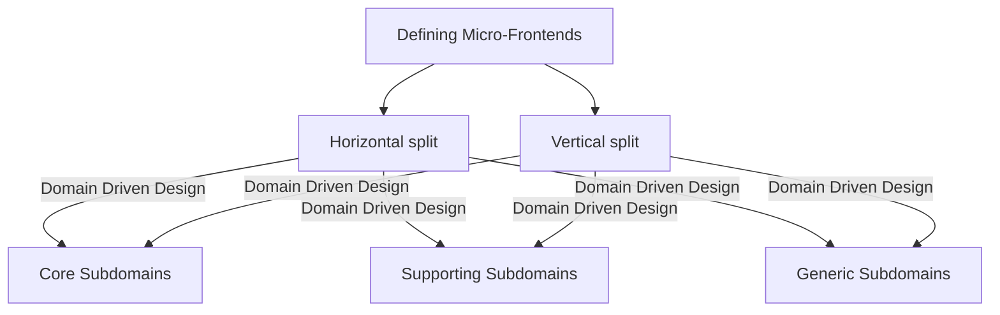

# GitHub Diagrams Example


### Example 1

 ```mermaid
graph TD;
  Micro-Frontend-->A1[Defining Micro-Frontends];
  Micro-Frontend-->A2[Composition of Micro-frontends];
  Micro-Frontend-->A3[Micro-Frontends Communication];
```

### Example 2


